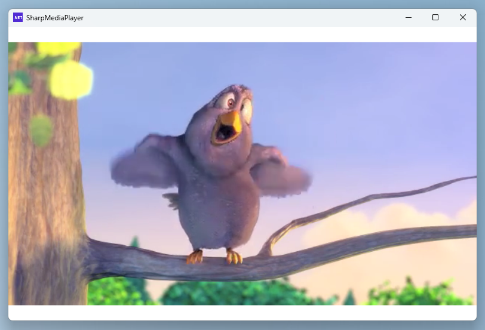

# Sharp Media Foundation Interop
Simple Windows Media Foundation interop written in C#. No native dependencies, only managed code. Windows only, for H265 and AV1 support it requires you to install extensions from the Microsoft Store.

[](https://www.nuget.org/packages/SharpMediaFoundationInterop)

## Codecs
Supported video codecs are:
- H264 (built-in Windows)
- H265 (requires paid HEVC Video Extensions from the Microsoft Store)
- AV1 (requires free AV1 Video Extensions from the Microsoft Store)

Supported audio codecs are:
- AAC (built-in Windows)
- Opus (built-in Windows, might require a newer version - works in Windows 11 25H2)

## Video decoding
Create and initialize the decoder (all decoders have the same API):
```cs
using (var videoDecoder = new AV1Decoder(width, height, timescale, defaultSampleDuration))
{
   videoDecoder.Initialize();
   ...
}
```
Create a buffer to hold the decoded frame:
```cs
var nv12Buffer = new byte[videoDecoder.OutputSize];
```
Pass the frame to the decoder and get the output:
```cs
IEnumerable<byte[]> units = ...; // get a list of NALU/OBU from your video source
foreach (var unit in units)
{
   if (videoDecoder.ProcessInput(unit, 0))
   {
      while (videoDecoder.ProcessOutput(ref nv12Buffer, out _))
      {
         // nv12Buffer holds the decoded nv12 frame
         ...
      }
   }
}
```
Optionally, decode nv12 to RGB to display it:
```cs
using(var nv12Decoder = new ColorConverter(PInvoke.MFVideoFormat_NV12, PInvoke.MFVideoFormat_RGB24, width, height))
{
    nv12Decoder.Initialize();
    
    byte[] rgbBuffer = new byte[nv12Decoder.OutputSize];
    if(nv12Decoder.ProcessInput(nv12Buffer, 0))
    {
       if (nv12Decoder.ProcessOutput(ref rgbBuffer, out _))
       {
          // rgbBuffer holds the decoded RGB frame
          ...
       }
    }
}
```
## Video encoding
Create and initialize the encoder (all encoders have the same API):
```cs
using (var videoEncoder = new H265Encoder(width, height, timescale, defaultSampleDuration))
{
   videoEncoder.Initialize();
   ...
}
```
Optionally, convert RGB to nv12:
```cs
using(var nv12Encoder = new ColorConverter(PInvoke.MFVideoFormat_RGB24, PInvoke.MFVideoFormat_NV12, width, height))
{
    nv12Encoder.Initialize();
    
    byte[] nv12Buffer = new byte[nv12Encoder.OutputSize];
    if(nv12Encoder.ProcessInput(rgbBuffer, 0))
    {
       if (nv12Encoder.ProcessOutput(ref nv12Buffer, out _))
       {
          // nv12Buffer holds the encoded nv12 frame
          ...
       }
    }
}
```
Create a buffer to hold the encoded NALU/OBU:
```cs
var au = new byte[videoEncoder.OutputSize];
```
Read encoded NALU/OBU:
```cs
if (videoEncoder.ProcessInput(nv12Buffer, timestamp))
{
   while (videoEncoder.ProcessOutput(ref au, out var length))
   {
      // au buffer holds the encoded access unit
      var parsedAU = AnnexBUtils.ParseNalu(au, length);
      foreach (var unit in parsedAU)
      {
         // here you can access the individual NALU/OBU
      }
   }
}
```
## Audio decoding
Create and initialize the decoder:
```cs
using (var audioDecoder = new OpusDecoder(960, channelCount, samplingRate, bitsPerSample))
{
   audioDecoder.Initialize();
   ...
}
```
Create a buffer to hold the decoded frame:
```cs
var pcmBuffer = new byte[audioDecoder.OutputSize];
```
Pass the frame to the decoder and get the output:
```cs
IEnumerable<byte[]> audioFrames = ...; // get a list of frames from your audio source
foreach (var audioFrame in audioFrames)
{
   if (audioDecoder.ProcessInput(audioFrame, 0))
   {
      while (audioDecoder.ProcessOutput(ref pcmBuffer, out _))
      {
         // pcmBuffer holds the decoded audio
         ...
      }
   }
}
```
## Audio encoding
Create and initialize the encoder:
```cs
using (var audioEncoder = new AACEncoder(channelCount, samplingRate, AACDecoder.CreateUserData(aacTrack.AudioSpecificConfig.ToBytes()), channelConfiguration))
{
   audioEncoder.Initialize();

   // audioDecoder.UserData holds the AAC user data
   ...
}
```
Create a buffer to hold the encoded frame:
```cs
var aacBuffer = new byte[audioEncoder.OutputSize];
```
Pass the frame to the decoder and get the output:
```cs
IEnumerable<byte[]> pcmFrames = ...; // get a list of frames from your audio source
foreach (var pcmFrame in pcmFrames)
{
   if (audioEncoder.ProcessInput(pcmFrame, 0))
   {
      while (audioEncoder.ProcessOutput(ref aacBuffer, out _))
      {
         // aacBuffer holds the encoded AAC audio
         ...
      }
   }
}
```
## ScreenCapture
Captures your screen using the [DuplicateOutput1](https://learn.microsoft.com/en-us/windows/win32/api/dxgi1_5/nf-dxgi1_5-idxgioutput5-duplicateoutput1) API. Start by enumerating the screens:
```cs
var screens = ScreenCapture.Enumerate();
```
Create the capture object:
```cs
using (var screenCapture = new ScreenCapture())
{
   ...
}
```
Initialize the selected screen capture:
```cs
screenCapture.Initialize(screens.First()); // select the screen (here we take the first one)
```
Create a buffer to hold the sample:
```cs
var buffer = new byte[screenCapture.OutputSize];
```
Read the sample:
```cs
if (screenCapture.ReadSample(buffer, out var timestamp))
{
   // captured screen is in the buffer
}
```
## DeviceCapture
Captures any Media Foundation device such as a webcam. Start by enumerating the devices:
```cs
var devices = DeviceCapture.Enumerate();
```
Create the capture object:
```cs
using(var device = new DeviceCapture())
{
   ...
}
```
Initialize the selected device:
```cs
device.Initialize(devices.First()); // select the device (here we take the first one) 
```
Create a buffer to hold the sample:
```cs
var buffer = new byte[device.OutputSize];
```
Read the sample:
```cs
if (device.ReadSample(buffer, out var timestamp))
{
   // captured image is in the buffer
}
```
## Audio input
Audio input is implemented using the [waveIn](https://learn.microsoft.com/en-us/windows/win32/api/mmeapi/nf-mmeapi-waveinopen) API. 
Start with creating the `WaveIn`:
```cs
using(var waveIn = new WaveIn())
{
    ...
}
```
Subscribe the `FrameReceived` callback:
```cs
waveIn.FrameReceived += (sender, e) => 
{
    byte[] pcmData = e.Data;
    ...
}
```
Recording starts right after you call `Initialize`. 
```cs
waveIn.Initialize(sampleRate, channelCount, bitsPerSample);
```
To stop the recording, call `Close` or `Dispose` the object:
```cs
waveIn.Close();
```
## Audio output
Audio output is implemented using the [waveOut](https://learn.microsoft.com/en-us/windows/win32/api/mmeapi/nf-mmeapi-waveoutopen) API.
Start with creating the `WaveOut`:
```cs
using(var waveOut = new WaveOut())
{
    waveOut.Initialize(sampleRate, channelCount, bitsPerSample);
    ...
}
```
To playback audio, just enqueue it:
```cs
byte[] pcmSample = ...
waveOut.Enqueue(pcmSample, (uint)pcmSample.Length);
```
## Samples

### SharpMediaPlayer
Sample WPF video player that supports RTSP real-time video, MP4 files, AVIF/HEIC/HEIF images, screen capture and Media Foundation devices such as a webcam.


### SharpMediaTranscoder
Demonstrates how to transcode H264 fragmented MP4 into H265 fragmented MP4.

### SharpScreenCapture
Demonstrates how to capture the screen and encode it into H265 MP4.

### SharpWavePlayer
Shows how to play AAC audio from a MP4 file.

### SharpWebcamRecoredr
Shows how to capture video from a webcam and record it into H265 MP4.