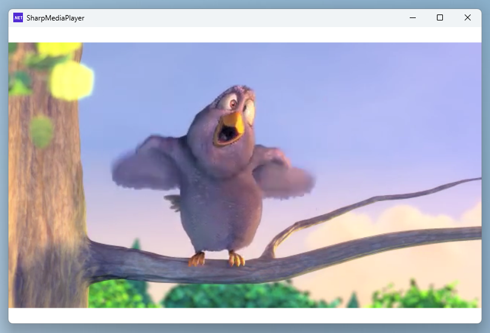

# Sharp Media Foundation Interop
Simple Windows Media Foundation interop written in C#. No native dependencies, only managed code.

[](https://www.nuget.org/packages/SharpMediaFoundationInterop)

## Platforms
The library is one plain `net8.0`/`net10.0` DLL. Its codecs and devices are reached through interfaces that belong to no platform - `IMediaVideoTransform`, `IMediaAudioTransform`, `IMediaVideoSource`, `IAudioOutput`, `IAudioInput` - made by two factories, `MediaCodecs` and `MediaDevices`, which pick what the system has:
- Windows 10 1809 or later: Media Foundation's codecs, waveOut/waveIn, Media Foundation's camera capture and DXGI's desktop duplication. Everything Windows-specific is marked `[SupportedOSPlatform("windows10.0.17763.0")]` and only called there.
- macOS 11 or later: VideoToolbox's and AudioToolbox's codecs, AudioQueue for sound out and in, AVFoundation for the camera, and ScreenCaptureKit (macOS 12.3 or later) for the screen. These are reached through P/Invoke as well - the system's C frameworks directly, AVFoundation and ScreenCaptureKit through the Objective-C runtime - so there is still no native dependency. Everything macOS-specific is marked `[SupportedOSPlatform("macos11.0")]` (`"macos12.3"` for screen capture).

The source follows the same split: `Codecs`, `Input`, `Output` and `Utils` each hold the interfaces and shared code, with the implementations of each platform in their `Windows` and `MacOS` folders. The namespaces are those four - `SharpMediaFoundationInterop.Codecs`, `.Input`, `.Output`, `.Utils` - whatever the platform, and `MediaDevices` is in `SharpMediaFoundationInterop` itself.

Elsewhere the factories report nothing: `MediaCodecs.CanDecode`/`CanEncode` return false, the device lists are empty, and creating one throws `PlatformNotSupportedException`. Code written against the factories needs no change from one platform to another.

The Windows classes behind the factories (`H265Decoder`, `AACEncoder`, `WaveOut`, `ScreenCapture`, ...) stay public for what only Media Foundation has: decoding on the GPU through `IMediaFoundationVideoTransform`, or ICodecAPI properties through `CodecProperties`. So do the macOS ones: `VideoToolboxDecoder`, `VideoToolboxEncoder`, `AudioToolboxDecoder`, `AudioToolboxEncoder`, `AudioQueueOutput`, `AudioQueueInput`, `AVFoundationCapture` and `ScreenCaptureKitCapture`.

On macOS the user is asked, the first time, whether the app may use the microphone, the camera or the screen; the permission belongs to the app the process runs in (for a console app, the terminal). Until it is given, the camera capture throws `UnauthorizedAccessException`, as the screen capture does - which asks macOS to show the request - and the microphone records silence. macOS applies a new screen recording permission only once the app is started again.

## Codecs
Supported video codecs (`VideoCodec`) are:
- H264 (built-in Windows)
- H265 (requires paid HEVC Video Extensions from the Microsoft Store)
- AV1 (requires free AV1 Video Extensions from the Microsoft Store)
- VP9 (requires free VP9 Video Extensions from the Microsoft Store)
- MPEG-2 and MPEG-1, decoding only (requires MPEG-2 Video Extension from the Microsoft Store)
- H263, decoding only (built-in Windows)
- MPEG-4 Part 2, decoding only (built-in Windows; B-frames are skipped, Windows decodes them blank)

Windows has no usable encoder for MPEG-1/2, H263 or MPEG-4 Part 2, and no H261 decoder. Nor has it AC-3 or E-AC-3 decoders: those it once had are gone, and what is left passes the stream on to a receiver over S/PDIF. Whether an extension is installed shows only when the codec is initialized, which then throws `NotSupportedException`.

macOS decodes every one of these video codecs with VideoToolbox, needing no extensions, with these limits:
- VP9 and AV1 are decoded on the GPU alone: VP9 on Apple silicon and some Intel Macs, AV1 on the M3 and later. `MediaCodecs.CanDecode` says which.
- MPEG-4 Part 2 of the simple profile alone. A stream of the advanced simple profile - B-VOPs, as XviD and DivX often have - throws `NotSupportedException` as its headers come in.

macOS encodes H264 and H265 (H265 on Apple silicon, and Intel Macs whose GPU encodes it); it has no VP9 or AV1 encoder, which `MediaCodecs.CanEncode` reports.

VideoToolbox is told a stream's configuration before it decodes, so the decoder is made as that configuration comes in band: the parameter sets of H264 and H265, the headers before the first MPEG-4 picture, the first VP9 key frame, the AV1 sequence header. Whatever comes before it is dropped.

Supported audio codecs (`AudioCodec`) are:
- AAC (built-in Windows)
- MP3 (built-in Windows; the encoder at 32000, 44100 or 48000 Hz, or MPEG-2's lower rates, and its own list of bit rates)
- FLAC, 16 and 24 bits (built-in Windows)
- ALAC, 16 and 24 bits (built-in Windows; the encoder pads the last frame to 4096 samples with silence)
- Opus (built-in Windows, might require a newer version - works in Windows 11 25H2). The decoder takes mono and stereo, not more channels. The encoder is not on every Windows: where the system has none, `Initialize` throws `NotSupportedException`.

On macOS, AudioToolbox decodes all five, to the same PCM formats as on Windows; more than two channels come out in WAVE's order, as Windows' decoders give them. It encodes all but MP3, of which macOS has no encoder, taking the same PCM as Windows' encoders.

## Video decoding
Create and initialize the decoder; every codec has the same API. The size is the coded one, as the stream's parameter sets give it:
```cs
var options = new VideoDecoderOptions
{
   Width = width,
   Height = height,
   FpsNom = timescale,               // a hint; 0 over 0 where the stream does not say
   FpsDenom = defaultSampleDuration,
};
using (var videoDecoder = MediaCodecs.CreateVideoDecoder(VideoCodec.AV1, options))
{
   videoDecoder.Initialize();
   ...
}
```
Frames come out as NV12, padded to the size the decoder works in: `videoDecoder.Width` by `videoDecoder.Height`, or `MediaCodecs.DecoderAlignment(codec)` before there is a decoder. On macOS that alignment is 2 for every codec; the picture is in the top left of each frame. Create a buffer to hold the decoded frame:
```cs
var nv12Buffer = new byte[videoDecoder.OutputSize];
```
Pass the frame to the decoder and get the output. A decoder hands frames out in display order, each with the timestamp of the input it came from. On macOS, where VideoToolbox hands them out in decode order, they are put in order by those timestamps, so give each frame its own:
```cs
IEnumerable<byte[]> units = ...; // get a list of NALU/OBU from your video source
foreach (var unit in units)
{
   if (videoDecoder.ProcessInput(unit, timestamp))
   {
      while (videoDecoder.ProcessOutput(ref nv12Buffer, out _, out long frameTime))
      {
         // nv12Buffer holds the decoded nv12 frame
         ...
      }
   }
}
```
At the end of the stream, drain the frames the decoder still holds, and read them out before taking input again - audio decoders and encoders alike:
```cs
videoDecoder.BeginDrain();
while (videoDecoder.ProcessOutput(ref nv12Buffer, out _, out long frameTime))
{
   ...
}
videoDecoder.EndDrain();
```
On Windows, convert NV12 to RGB for display with Media Foundation's color converter:
```cs
using(var nv12Decoder = new ColorConverter(PInvoke.MFVideoFormat_NV12, PInvoke.MFVideoFormat_RGB24, width, height))
{
    nv12Decoder.Initialize();
    
    byte[] rgbBuffer = new byte[nv12Decoder.OutputSize];
    if(nv12Decoder.ProcessInput(nv12Buffer, 0))
    {
       if (nv12Decoder.ProcessOutput(ref rgbBuffer, out _))
       {
          // rgbBuffer holds the decoded RGB frame
          ...
       }
    }
}
```
## Video encoding
Create and initialize the encoder; every codec has the same API:
```cs
var options = new VideoEncoderOptions
{
   Width = width,
   Height = height,
   FpsNom = timescale,
   FpsDenom = defaultSampleDuration,
   Bitrate = 8000000,
   RateControl = RateControlMode.ConstantQp, // or Default, ConstantBitrate, VariableBitrate, Quality
   Qp = 24,
   KeyFrameInterval = 60,                    // 0 leaves it to the encoder
};
using (var videoEncoder = MediaCodecs.CreateVideoEncoder(VideoCodec.H265, options))
{
   videoEncoder.Initialize();

   // support for each setting varies by codec and vendor: a setting the encoder did not take is reported, not thrown
   foreach (var setting in videoEncoder.UnappliedSettings)
      Console.WriteLine(setting);
   ...
}
```
Optionally, on Windows, convert RGB to nv12:
```cs
using(var nv12Encoder = new ColorConverter(PInvoke.MFVideoFormat_RGB24, PInvoke.MFVideoFormat_NV12, width, height))
{
    nv12Encoder.Initialize();
    
    byte[] nv12Buffer = new byte[nv12Encoder.OutputSize];
    if(nv12Encoder.ProcessInput(rgbBuffer, 0))
    {
       if (nv12Encoder.ProcessOutput(ref nv12Buffer, out _))
       {
          // nv12Buffer holds the encoded nv12 frame
          ...
       }
    }
}
```
Each access unit comes out in Annex B, with its start codes; a key frame has the parameter sets in front of it. On macOS the encoder takes NV12 of exactly `Width` by `Height`, encodes no B-frames, and reports a setting it has no equivalent of - `Threads` - in `UnappliedSettings`.

Create a buffer to hold the encoded NALU/OBU:
```cs
var au = new byte[videoEncoder.OutputSize];
```
Read encoded NALU/OBU:
```cs
if (videoEncoder.ProcessInput(nv12Buffer, timestamp))
{
   while (videoEncoder.ProcessOutput(ref au, out var length))
   {
      // au buffer holds the encoded access unit
      var parsedAU = AnnexBUtils.ParseNalu(au, length);
      foreach (var unit in parsedAU)
      {
         // here you can access the individual NALU/OBU
      }
   }
}
```
## Audio decoding
Create and initialize the decoder. AAC needs its AudioSpecificConfig, which the MP4 file's `esds` box holds; FLAC its metadata blocks, each with its header, as the `dfLa` box holds them; ALAC its ALACSpecificConfig, the 24 byte magic cookie. The channels, rate and bits of FLAC and ALAC are read of those. MP3 needs no config, and Opus none, but give Opus its pre-skip, the samples the decoder needs to warm up, so that they are dropped:
```cs
var options = new AudioDecoderOptions
{
   Channels = channelCount,
   SampleRate = samplingRate,
   Config = aacTrack.AudioSpecificConfig.ToBytes(), // AAC
   SkipSamples = opusTrack.PreSkip,                 // Opus
};
using (var audioDecoder = MediaCodecs.CreateAudioDecoder(AudioCodec.AAC, options))
{
   audioDecoder.Initialize();
   ...
}
```
AAC and MP3 decode to 16 bit PCM, Opus to 32 bit float, FLAC and ALAC to PCM of the stream's own bits. Create a buffer to hold the decoded frame:
```cs
var pcmBuffer = new byte[audioDecoder.OutputSize];
```
Pass the frame to the decoder and get the output:
```cs
IEnumerable<byte[]> audioFrames = ...; // get a list of frames from your audio source
foreach (var audioFrame in audioFrames)
{
   if (audioDecoder.ProcessInput(audioFrame, 0))
   {
      while (audioDecoder.ProcessOutput(ref pcmBuffer, out var length))
      {
         // pcmBuffer holds the decoded audio
         ...
      }
   }
}
```
## Audio encoding
Create and initialize the encoder. Windows' AAC encoder takes 44100 or 48000 Hz, 16 bit PCM, 1024 samples a frame; FLAC and ALAC 16 or 24 bit PCM (`BitsPerSample`), a frame of 4096 samples; MP3 16 bit PCM, at the `Bitrate` nearest its list. The config for the MP4 file is `Config`: AAC's AudioSpecificConfig, FLAC's metadata blocks - complete, with the total samples and MD5, once the encoder is drained - or ALAC's magic cookie:
```cs
var options = new AudioEncoderOptions { Channels = channelCount, SampleRate = samplingRate };
using (var audioEncoder = MediaCodecs.CreateAudioEncoder(AudioCodec.AAC, options))
{
   audioEncoder.Initialize();

   // the AudioSpecificConfig, for the MP4 file's esds box
   byte[] audioSpecificConfig = audioEncoder.Config;
   ...
}
```
Create a buffer to hold the encoded frame:
```cs
var aacBuffer = new byte[audioEncoder.OutputSize];
```
Pass the frame to the encoder and get the output:
```cs
IEnumerable<byte[]> pcmFrames = ...; // get a list of frames from your audio source
foreach (var pcmFrame in pcmFrames)
{
   if (audioEncoder.ProcessInput(pcmFrame, 0))
   {
      while (audioEncoder.ProcessOutput(ref aacBuffer, out var length))
      {
         // aacBuffer holds the encoded AAC audio
         ...
      }
   }
}
```
## Devices
`MediaDevices` lists the system's devices with `GetScreens()`, `GetCameras()`, `GetAudioOutputs()` and `GetAudioInputs()`, each a `MediaDevice` with an `Id` and a `Name`, and creates them. Leave the device null for the system's default.

### Screen capture
Captures a screen as 32 bit BGRA (on Windows, with the [DuplicateOutput1](https://learn.microsoft.com/en-us/windows/win32/api/dxgi1_5/nf-dxgi1_5-idxgioutput5-duplicateoutput1) API; on macOS, with [ScreenCaptureKit](https://developer.apple.com/documentation/screencapturekit), at the display's size in pixels). Rows are bottom-up by default, as Media Foundation's RGB formats are, or top-down, as a bitmap is:
```cs
var screens = MediaDevices.GetScreens(); // the primary first
using (var screenCapture = MediaDevices.CreateScreenCapture(screens.First(), topDown: false))
{
   screenCapture.Initialize();
   ...
}
```
Create a buffer to hold the sample:
```cs
var buffer = new byte[screenCapture.OutputSize];
```
Read the sample. A frame is returned only when the screen has changed:
```cs
if (screenCapture.ReadSample(buffer, out var timestamp))
{
   // captured screen is in the buffer
}
```
### Camera capture
Captures a camera (on Windows, any Media Foundation video capture device such as a webcam; on macOS, with AVFoundation, as NV12) in the best format it offers, which `OutputFormat` reports:
```cs
var cameras = MediaDevices.GetCameras();
using (var camera = MediaDevices.CreateCameraCapture(cameras.First()))
{
   camera.Initialize();
   ...
}
```
Create a buffer to hold the sample:
```cs
var buffer = new byte[camera.OutputSize];
```
Read the sample:
```cs
if (camera.ReadSample(buffer, out var timestamp))
{
   // captured image is in the buffer
}
```
### Audio input
Records PCM (on Windows, with the [waveIn](https://learn.microsoft.com/en-us/windows/win32/api/mmeapi/nf-mmeapi-waveinopen) API; on macOS, with [AudioQueue](https://developer.apple.com/documentation/audiotoolbox/audio-queue-services)):
```cs
using (var audioInput = MediaDevices.CreateAudioInput(sampleRate, channelCount, bitsPerSample))
{
    ...
}
```
Subscribe the `FrameReceived` callback:
```cs
audioInput.FrameReceived += (sender, e) => 
{
    byte[] pcmData = e.Data;
    ...
};
```
Recording starts right after you call `Initialize`, and stops with `Reset` or `Dispose`:
```cs
audioInput.Initialize();
```
### Audio output
Plays PCM (on Windows, with the [waveOut](https://learn.microsoft.com/en-us/windows/win32/api/mmeapi/nf-mmeapi-waveoutopen) API; on macOS, with AudioQueue):
```cs
using (var audioOutput = MediaDevices.CreateAudioOutput(sampleRate, channelCount, bitsPerSample))
{
    audioOutput.Initialize();
    ...
}
```
To play audio, enqueue it. `QueuedFrames` is the number of buffers still to play, `GetPosition()` the bytes played so far, and `Pause`, `Resume` and `Reset` control playback:
```cs
byte[] pcmSample = ...
audioOutput.Enqueue(pcmSample, (uint)pcmSample.Length);
```
## Video control
`VideoControl` (drawn into a bitmap) and `VideoControlD3D` (drawn with Direct3D) play a video source, with a bar of controls over the bottom of the video. The bar shows as the mouse moves over the video and fades out after `ControlsHideDelay`, or as the mouse leaves; it stays while the video is paused. Set `AutoHideControls="False"` to always show it, or `ShowControls="False"` to never show it.

The bar is part of the control's template, and can be restyled or replaced from XAML. Its buttons send WPF's `MediaCommands` (`TogglePlayPause`, `Play`, `Pause`, `Rewind`, `FastForward`, `MuteVolume`), and the control's read-only properties say what to show: `IsPlaying`, `CanSeek`, `PlaybackRate`, `Position`, `Duration`, `TimeText` and `AreControlsVisible`. The template is also put in the visual state `ControlsVisible` or `ControlsHidden`. Template parts, all optional: `PART_Image` (the frames are drawn on it), `PART_Seek` (a `Slider` that seeks) and `PART_ControlsBar` (kept shown while the mouse is over it).
```xml
<ctrl:VideoControl Source="{Binding Source}">
    <ctrl:VideoControl.Template>
        <ControlTemplate TargetType="ctrl:VideoControl">
            <Grid Background="Transparent">
                <Image x:Name="PART_Image" />
                <StackPanel x:Name="Bar" Orientation="Horizontal" VerticalAlignment="Bottom" Background="#80000000">
                    <Button x:Name="PlayPause" Command="MediaCommands.TogglePlayPause" Content="Play" Focusable="False" />
                    <TextBlock Foreground="White" Margin="8,0" Text="{TemplateBinding TimeText}" />
                </StackPanel>
            </Grid>
            <ControlTemplate.Triggers>
                <Trigger Property="IsPlaying" Value="True">
                    <Setter TargetName="PlayPause" Property="Content" Value="Pause" />
                </Trigger>
                <Trigger Property="AreControlsVisible" Value="False">
                    <Setter TargetName="Bar" Property="Visibility" Value="Hidden" />
                </Trigger>
            </ControlTemplate.Triggers>
        </ControlTemplate>
    </ctrl:VideoControl.Template>
</ctrl:VideoControl>
```
To restyle only the default template's buttons, base a style on `{StaticResource {x:Static ctrl:VideoControlBase.ButtonStyleKey}}`. The seek bar - a thin track and a round thumb with a dot, as Windows 11's Media Player draws it - is `VideoControlBase.SeekSliderStyleKey`; its `Foreground` is the accent colour of the part played and the dot, and its `Background` the rest of the track.

### Subtitles
Both controls show subtitles: of a file, its subtitle tracks (3GPP timed text, WebVTT, TTML), and SubRip or WebVTT files beside it named after it (`movie.srt`, `movie.en.srt`, `movie.de.forced.vtt`). `SubtitleTracks` lists them, and `SubtitleTrack` chooses one, -1 (the default) for none; the bar's CC button (or C) goes through them. A forced track is shown even with subtitles off. Where both eyes of a stereo video are shown side by side, the subtitle is shown over each. A source of its own gives subtitles by implementing `ISubtitleSource`, and a data template of the key `VideoControlBase.SubtitleTemplateKey` draws them otherwise.

### Stereo and VR video
A stereo video's frame holds both eyes, side by side or top and bottom. `EyeView` shows both as the frame has them, or the left or right eye alone; the bar gets an eye button for it (or press E). `VideoFileSource` reads the layout from the file's `st3d` box, and `StereoLayout` overrides it for a file that does not say.

Two separate videos, one per eye, play as one stereo video side by side through `StereoVideoSource`, which decodes each eye on its own thread and pairs the frames by their times:
```cs
var source = new StereoVideoSource(new VideoFileSource("left.mp4"), new VideoFileSource("right.mp4"));
```

A 180 or 360 degree video (equirectangular, as a VR180 camera writes it, read from the file's `sv3d` box, or forced with `Projection`) is shown by `VideoControlD3D` as a view into the sphere, drawn on the GPU: drag to look around, use the wheel to zoom, and double-click to look straight ahead again. `Yaw`, `Pitch` and `FieldOfView` hold the view and can be bound to. Of a stereo VR video, `EyeView` shows one eye's view, or both side by side. `VideoControl` shows such a video flat.

## Samples
The console samples run on Windows and macOS alike; the WPF player is Windows' alone. The recorders take how long to record, in seconds, as their first argument - `dotnet run -- 10` - or record until a key is pressed.

### SharpMediaPlayer
Sample WPF video player that supports RTSP real-time video, MP4 files, AVIF/HEIC/HEIF images, screen capture and Media Foundation devices such as a webcam.


### SharpMediaTranscoder
Demonstrates how to transcode H264 fragmented MP4 into H265 fragmented MP4.

### SharpScreenCapture
Demonstrates how to capture the screen and encode it into H265 MP4.

### SharpWavePlayer
Shows how to play AAC audio from a MP4 file.

### SharpWebcamRecorder
Shows how to capture video from a webcam and record it into H265 MP4.